# Alerts Notification System

> **Completed for PROG2200 Final Project**
> 
> Lauren MacDonald, December 2023
> 
> **Languages/Concepts**: Java, Object-Oriented Programming, SOLID design, Spring Boot, REST API

## How to Use
### XAMPP
This program is set up to connect with MySQL and can be used with XAMPP to access the server. To download XAMPP:
https://www.apachefriends.org Follow the installation and set up instructions.

### Creating the database and applicable tables.
Import the SQL document 'alertsystem.sql' into MySQL. 

### Using the API.
Ensure the Java program is running, XAMPP is running Apache and MySQL and that the alertsystem database is set up.
Use any of the API endpoints and ensure the parameter is a valid input.

## Background
### PROG2200 Final Project Instructions:
Use Spring Boot to create REST API endpoints that return JSON holding data related to the parameters supplied to the 
GET request URL.

In this fictitious scenario, an API is required for emergency services to retrieve information about dwellings and
people in the event of an emergency. 
Some examples are: 
- getting information about people in the house that is on fire, 
- list of phone numbers to send emergency alerts to people in the area of a flood or a severe storm

### Project Requirements
Spring boot endpoints that produce JSON output from the corresponding URLs.

- http://localhost:8080/firestation?stationNumber=XXX
  - Returns a list of people serviced by the corresponding fire station. The list should include first name, last name,
  address, and phone number. Should also provide a summary of the number of adults in the service area and the number
  of children (18 or younger).
- http://localhost:8080/childAlert?address=XXX+XXX+XXXX
  - Returns a list of children (18 or younger) at that address. The list should include the first and last name of each
  child, their age, and a list of other people living at that address. If no children, the URL can return an empty string.
- http://localhost:8080/phoneAlert?firestation=XXX
  - Returns a list of phone numbers of each person within the fire station's jurisdiction.
- http://localhost:8080/fire?address=XXX+XXX+XXXX
  - Returns the fire station number that services the provided address as well as a list of all the people living at the
  address. This list includes each person's name, phone number, age, medications with dosage, and allergies
- http://localhost:8080/flood?stationNumbers=stationNumbers=XXX&stationNumbers=XXX
  - Returns a list of all the households in each fire station's jurisdiction. List needs to group people by address,
  include names, phone number, age, medications and allergies for each person.
- http://localhost:8080/personInfo?firstName=XXXXX&lastName=XXXXX
  - Returns the person's name, address, age, email, list of medications and allergies. If more than one person with the
  same name, this URL should return all of them.
- http://localhost:8080/communityEmail?city=XXXXXX
  - Returns the email addresses of all the people in the city.

## Program Execution

### Entity Relationship Diagram of Database
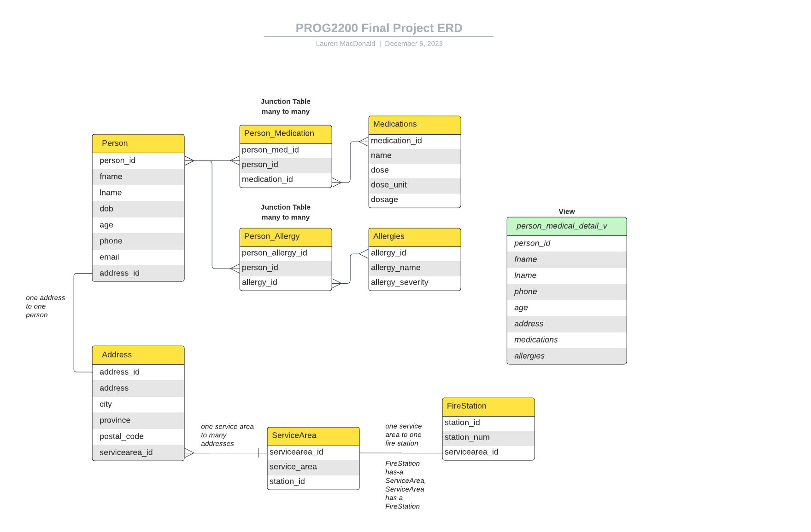

### Overview
#### Models 
The Model directory holds the POJO (plain old java object) classes/entities that connect to the database to retrieve 
data. POJOs are created for the address, fire station, person and service area tables. The person_medical_detail_v view 
is also connected as an entity for use. As the view is created via the Person_Medication and Person_Allergy junction tables
within MySQL, these tables are not included in the Java application.

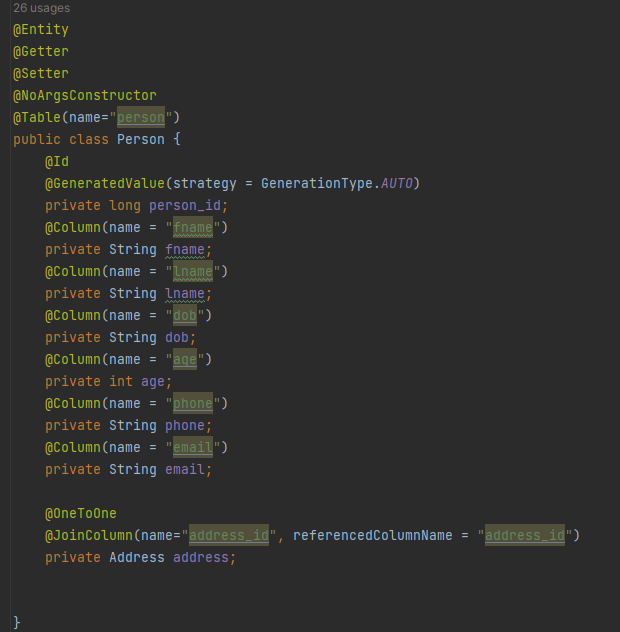

#### Repository
The Repository directory holds interfaces that extend the JPARepository functionality. Query methods are used to access 
data in the database and make connections between links in tables. Custom queries are also used where applicable.

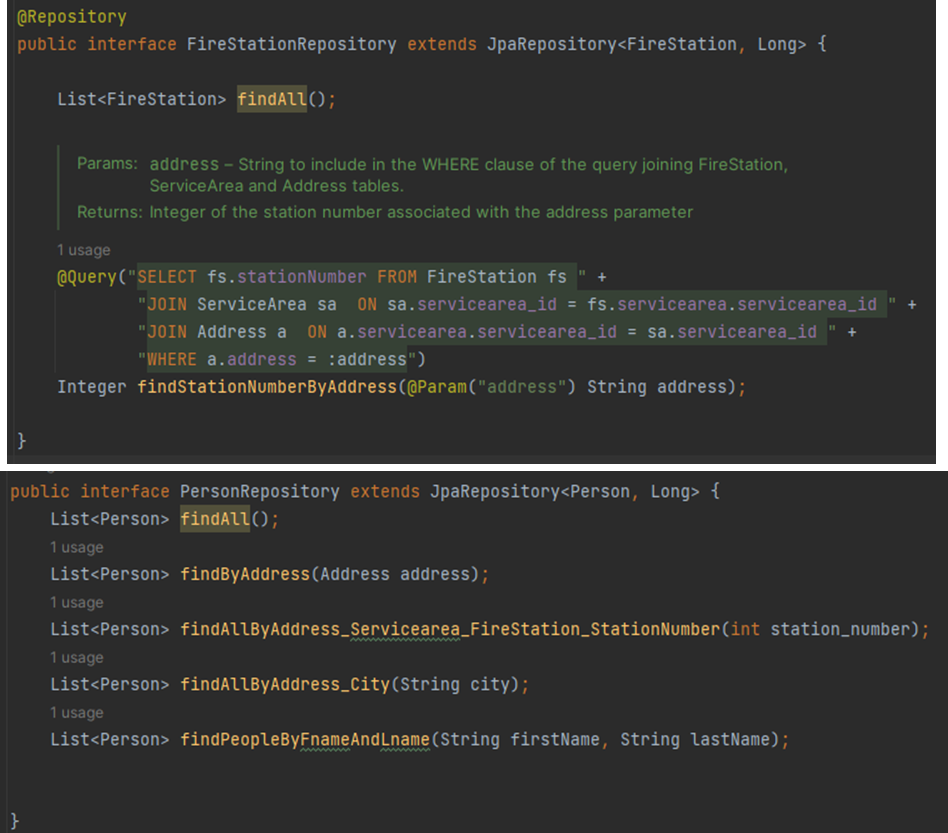

#### Service
The Service directory holds Service classes which use the Repository classes to work with the data accessed in the
Repository classes.

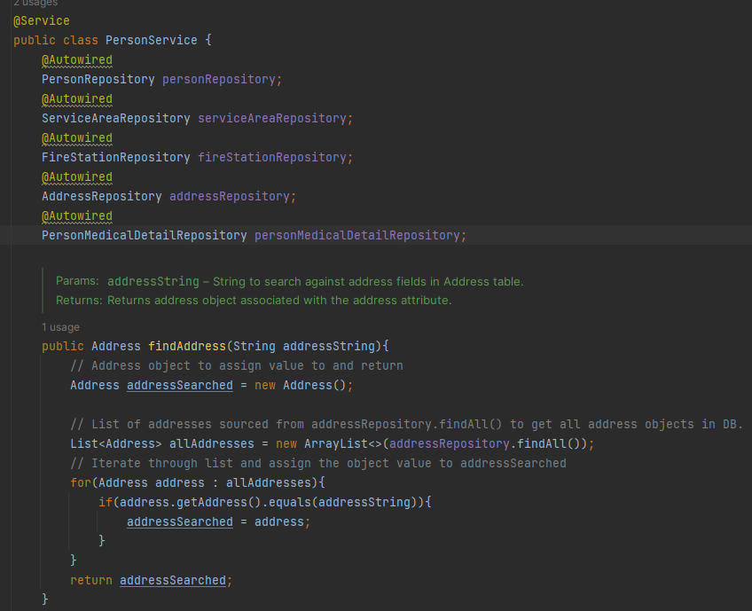

#### Controller
The Controller directory holds the Controller class which uses the Service classes to create the REST API endpoints.

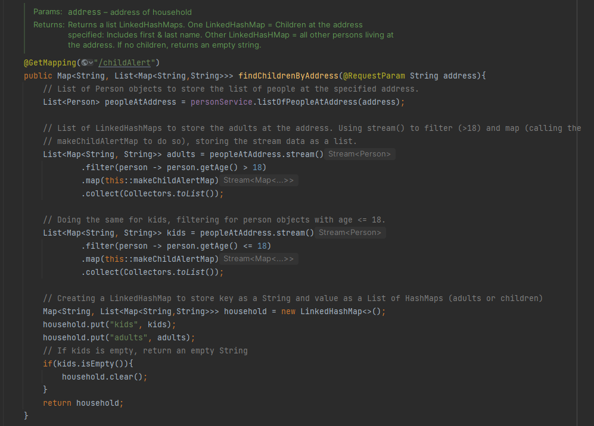

## Screenshots of JSON Output
- http://localhost:8080/firestation?stationNumber=XXX
  - Returns a list of people serviced by the corresponding fire station. The list should include first name, last name,
    address, and phone number. Should also provide a summary of the number of adults in the service area and the number
    of children (18 or younger).
  - 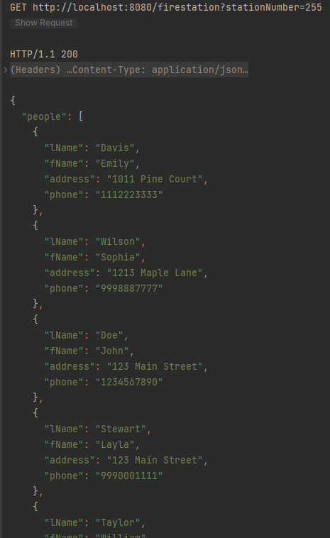
  

- http://localhost:8080/childAlert?address=XXX+XXX+XXXX
  - Returns a list of children (18 or younger) at that address. The list should include the first and last name of each
    child, their age, and a list of other people living at that address. If no children, the URL can return an empty string.
  - 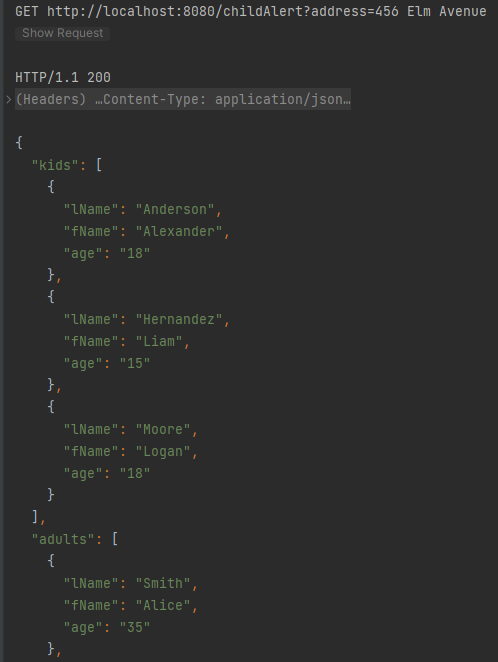

- http://localhost:8080/phoneAlert?firestation=XXX
  - Returns a list of phone numbers of each person within the fire station's jurisdiction.
  - 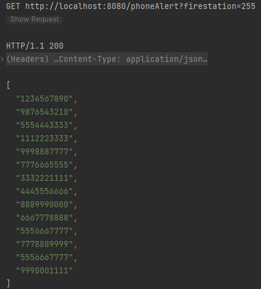

- http://localhost:8080/fire?address=XXX+XXX+XXXX
  - Returns the fire station number that services the provided address as well as a list of all the people living at the
    address. This list includes each person's name, phone number, age, medications with dosage, and allergies
  - 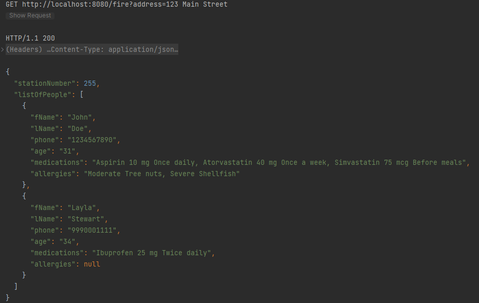

- http://localhost:8080/flood?stationNumbers=stationNumbers=XXX&stationNumbers=XXX
  - Returns a list of all the households in each fire station's jurisdiction. List needs to group people by address,
    include names, phone number, age, medications and allergies for each person.
  - 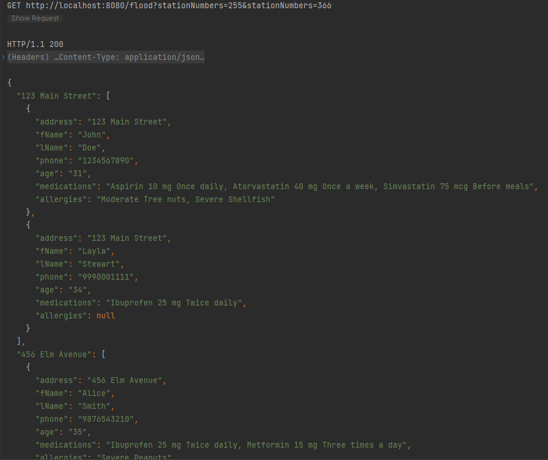

  
- http://localhost:8080/personInfo?firstName=XXXXX&lastName=XXXXX
  - Returns the person's name, address, age, email, list of medications and allergies. If more than one person with the
    same name, this URL should return all of them.
  - 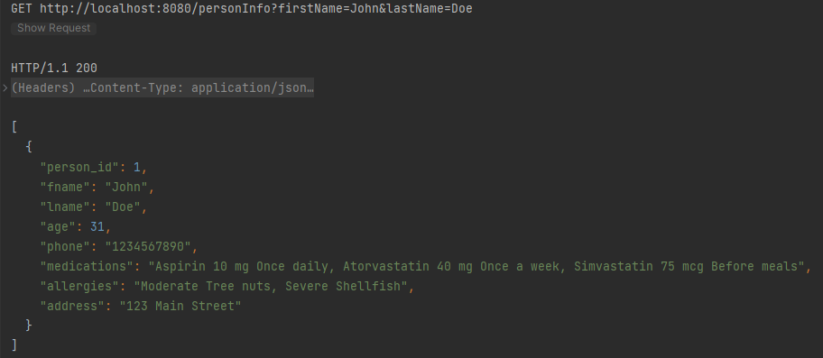

- http://localhost:8080/communityEmail?city=XXXXXX
  - Returns the email addresses of all the people in the city.
  - 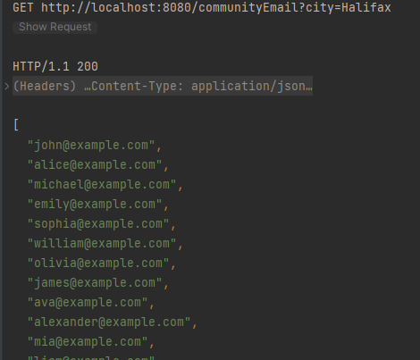

